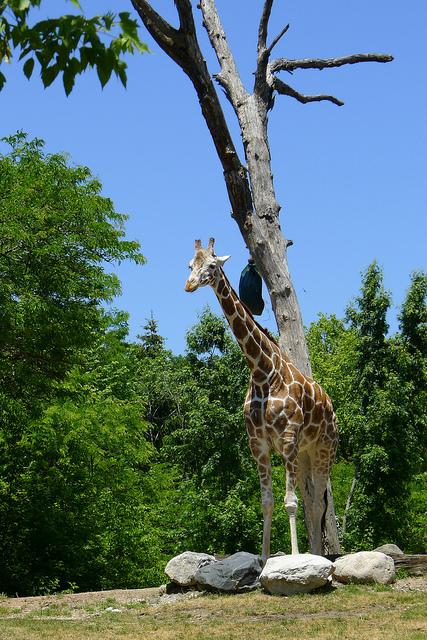
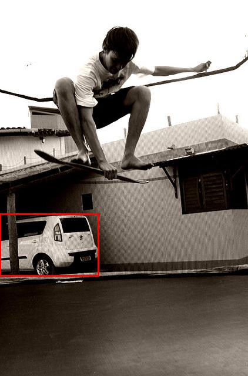

# Vision-Language Instruction Tuning: A Review and Analysis

---

This paper is a review of all the works related to vision-language instruction tuning (VLIT). We will periodically update the recent public  VLIT dataset and the VLIT data constructed by the pipeline in this paper.

## 📆 Schedule

- ⬜️ Release New Instruction Data (periodically) ...
- ⬜️ Update Public VLIT Datasets and Related Work (periodically) ... 
- ⬜️ Release Construction Tools
- ☑️ [2023.11.16] Release Instruction Data
- ☑️ [2023.11.15] Paper Released ([ArXiv](https://arxiv.org/abs/2311.08172))


## 🏷️ Catalogue

1. <a href="#label_evd">Existing VLIT Data</a>


<span id="label_evd_1">  </span>

## 🗒️ Existing VLIT Dataset

| Dataset | MLLM | Paper |
| :--- | :--- | :---|
| LVIS-INSTRUCT4V | - | [To See is to Believe: Prompting GPT-4V for Better Visual Instruction Tuning](https://github.com/palchenli/VL-Instruction-Tuning/blob/main/assert/paper/To%20See%20is%20to%20Believe-%20Prompting%20GPT-4V%20for%20Better%20Visual%20Instruction%20Tuning.pdf) |
| GranD | GLaMM | [GLaMM: Pixel Grounding Large Multimodal Model](https://github.com/palchenli/VL-Instruction-Tuning/blob/main/assert/paper/GLaMM%20-%20Pixel%20Grounding%20Large%20Multimodal%20Model.pdf) |
| ComVint | - | [What Makes for Good Visual Instructions? Synthesizing Complex Visual Reasoning Instructions for Visual Instruction Tuning](https://github.com/palchenli/VL-Instruction-Tuning/blob/main/assert/paper/What%20Makes%20for%20Good%20Visual%20Instructions%3F%20Synthesizing%20Complex%20Visual%20Reasoning%20Instructions%20for%20Visual%20Instruction%20Tuning.pdf) |
| MiniGPT-v2 | MiniGPT-v2 | [MiniGPT-v2: Large Language Model As a Unified Interface for Vision-Language Multi-task Learning](https://github.com/palchenli/VL-Instruction-Tuning/blob/main/assert/paper/MiniGPT-v2-%20Large%20Language%20Model%20As%20a%20Unified%20Interface%20for%20Vision-Language%20Multi-task%20Learning.pdf) |
| Ferret | Ferret | [FERRET REFER AND GROUND ANYTHING ANYWHERE AT ANY GRANULARITY](https://github.com/palchenli/VL-Instruction-Tuning/blob/main/assert/paper/FERRET%20REFER%20AND%20GROUND%20ANYTHING%20ANYWHERE%20AT%20ANY%20GRANULARITY.pdf) |
| SparklesDialogue-VG | SparklesChat | [Sparkles: Unlocking Chats Across Multiple Images for Multimodal Instruction-Following Models](https://github.com/palchenli/VL-Instruction-Tuning/blob/main/assert/paper/Sparkles-%20Unlocking%20Chats%20Across%20Multiple%20Images%20for%20Multimodal%20Instruction-Following%20Models.pdf) |
| SparklesDialogue-CC | SparklesChat | [Sparkles: Unlocking Chats Across Multiple Images for Multimodal Instruction-Following Models](https://github.com/palchenli/VL-Instruction-Tuning/blob/main/assert/paper/Sparkles-%20Unlocking%20Chats%20Across%20Multiple%20Images%20for%20Multimodal%20Instruction-Following%20Models.pdf) |
| InternLM-XComposer | InternLM-XComposer | [InternLM-XComposer: A Vision-Language Large Model for Advanced Text-image Comprehension and Composition](https://github.com/palchenli/VL-Instruction-Tuning/blob/main/assert/paper/InternLM-XComposer-%20A%20Vision-Language%20Large%20Model%20for%20Advanced%20Text-image%20Comprehension%20and%20Composition.pdf) |
| AnyMAL | AnyMAL | [AnyMAL: An Efficient and Scalable Any-Modality Augmented Language Model](https://github.com/palchenli/VL-Instruction-Tuning/blob/main/assert/paper/AnyMAL-%20An%20Efficient%20and%20Scalable%20Any-Modality%20Augmented%20Language%20Model.pdf) |
| DreamLLM | DreamLLM | [DREAMLLM: SYNERGISTIC MULTIMODAL COMPREHENSION AND CREATION](https://github.com/palchenli/VL-Instruction-Tuning/blob/main/assert/paper/DREAMLLM-%20SYNERGISTIC%20MULTIMODAL%20COMPREHENSION%20AND%20CREATION.pdf) |
| TextBind | TextBind | [TEXTBIND: Multi-turn Interleaved Multimodal Instruction-following in the Wild](https://github.com/palchenli/VL-Instruction-Tuning/blob/main/assert/paper/TEXTBIND-%20Multi-turn%20Interleaved%20Multimodal%20Instruction-following%20in%20the%20Wild.pdf) |
| PVIT | PVIT | [Position-Enhanced Visual Instruction Tuning for Multimodal Large Language Models](https://github.com/palchenli/VL-Instruction-Tuning/blob/main/assert/paper/Position-Enhanced%20Visual%20Instruction%20Tuning%20for%20Multimodal%20Large%20Language%20Models.pdf) |
| T2M | NExT-GPT | [NExT-GPT: Any-to-Any Multimodal LLM](https://github.com/palchenli/VL-Instruction-Tuning/blob/main/assert/paper/NExT-GPT-%20Any-to-Any%20Multimodal%20LLM.pdf) |
| MosIT | NExT-GPT | [NExT-GPT: Any-to-Any Multimodal LLM](https://github.com/palchenli/VL-Instruction-Tuning/blob/main/assert/paper/NExT-GPT-%20Any-to-Any%20Multimodal%20LLM.pdf) |
| GPTVQA | MLLM-DataEngine | [MLLM-DataEngine: An Iterative Refinement Approach for MLLM](https://github.com/palchenli/VL-Instruction-Tuning/blob/main/assert/paper/MLLM-DataEngine-%20An%20Iterative%20Refinement%20Approach%20for%20MLLM.pdf) |
| CIEM | - | [CIEM: Contrastive Instruction Evaluation Method for Better Instruction Tuning](https://github.com/palchenli/VL-Instruction-Tuning/blob/main/assert/paper/CIEM-%20Contrastive%20Instruction%20Evaluation%20Method%20for%20Better%20Instruction%20Tuning.pdf) |
| PointLLM | PointLLM | [PointLLM: Empowering Large Language Models to Understand Point Clouds](https://github.com/palchenli/VL-Instruction-Tuning/blob/main/assert/paper/PointLLM-%20Empowering%20Large%20Language%20Models%20to%20Understand%20Point%20Clouds.pdf) |
| VIGC | VIGC | [VIGC: Visual Instruction Generation and Correction](https://github.com/palchenli/VL-Instruction-Tuning/blob/main/assert/paper/VIGC-%20Visual%20Instruction%20Generation%20and%20Correction.pdf) |
| M-HalDetec | - | [Detecting and Preventing Hallucinations in Large Vision Language Models](https://github.com/palchenli/VL-Instruction-Tuning/blob/main/assert/paper/Detecting%20and%20Preventing%20Hallucinations%20in%20Large%20Vision%20Language%20Models.pdf) |
| StableLLaVA | StableLLaVA | [StableLLaVA: Enhanced Visual Instruction Tuning with Synthesized Image-Dialogue Data](https://github.com/palchenli/VL-Instruction-Tuning/blob/main/assert/paper/StableLLaVA-%20Enhanced%20Visual%20Instruction%20Tuning%20with%20Synthesized%20Image-Dialogue%20Data.pdf) |
| I4 | Cheetor | [EMPOWERING VISION-LANGUAGE MODELS TO FOLLOW INTERLEAVED VISION-LANGUAGE INSTRUCTIONS](https://github.com/palchenli/VL-Instruction-Tuning/blob/main/assert/paper/EMPOWERING%20VISION-LANGUAGE%20MODELS%20TO%20FOLLOW%20INTERLEAVED%20VISION-LANGUAGE%20INSTRUCTIONS.pdf) |
| AS-1B | ASM | [The All-Seeing Project: Towards Panoptic Visual Recognition and Understanding of the Open World](https://github.com/palchenli/VL-Instruction-Tuning/blob/main/assert/paper/The%20All-Seeing%20Project-%20Towards%20Panoptic%20Visual%20Recognition%20and%20Understanding%20of%20the%20Open%20World.pdf) |
| Multimodal_id_v1 | LMEye(IPN) | [LMEye: An Interactive Perception Network for Large Language Models](https://github.com/palchenli/VL-Instruction-Tuning/blob/main/assert/paper/LMEye-%20An%20Interactive%20Perception%20Network%20for%20Large%20Language%20Models.pdf) |
| Lynx | Lynx | [What Matters in Training a GPT4-Style Language Model with Multimodal Inputs?](https://github.com/palchenli/VL-Instruction-Tuning/blob/main/assert/paper/What%20Matters%20in%20Training%20a%20GPT4-Style%20Language%20Model%20with%20Multimodal%20Inputs%3F.pdf) |
| MGVLID  | ChatSpot | [ChatSpot: Bootstrapping Multimodal LLMs via Precise Referring Instruction Tuning](https://github.com/palchenli/VL-Instruction-Tuning/blob/main/assert/paper/ChatSpot-%20Bootstrapping%20Multimodal%20LLMs%20via%20Precise%20Referring%20Instruction%20Tuning.pdf) |
| BuboGPT | BuboGPT | [BuboGPT: Enabling Visual Grounding in Multi-Modal LLMs](https://github.com/palchenli/VL-Instruction-Tuning/blob/main/assert/paper/BuboGPT-%20Enabling%20Visual%20Grounding%20in%20Multi-Modal%20LLMs.pdf) |
| GRIT-20M | KOSMOS-2 | [KOSMOS-2: Grounding Multimodal Large Language Models to the World](https://github.com/palchenli/VL-Instruction-Tuning/blob/main/assert/paper/KOSMOS-2-%20Grounding%20Multimodal%20Large%20Language%20Models%20to%20the%20World.pdf) |
| SVIT | SVIT(MMLLM) | [SVIT: Scaling up Visual Instruction Tuning](https://github.com/palchenli/VL-Instruction-Tuning/blob/main/assert/paper/SVIT-%20Scaling%20up%20Visual%20Instruction%20Tuning.pdf) |
| GPT4RoI | GPT4RoI | [GPT4RoI: Instruction Tuning Large Language Model on Region-of-Interest](https://github.com/palchenli/VL-Instruction-Tuning/blob/main/assert/paper/GPT4RoI-%20Instruction%20Tuning%20Large%20Language%20Model%20on%20Region-of-Interest.pdf) |
| PF-1M | Clever Flamingo | [Visual Instruction Tuning with Polite Flamingo](https://github.com/palchenli/VL-Instruction-Tuning/blob/main/assert/paper/Visual%20Instruction%20Tuning%20with%20Polite%20Flamingo.pdf) |
| Shikra-RD | Shikra | [Shikra: Unleashing Multimodal LLM’s Referential Dialogue Magic](https://github.com/palchenli/VL-Instruction-Tuning/blob/main/assert/paper/Shikra-%20Unleashing%20Multimodal%20LLM%E2%80%99s%20Referential%20Dialogue%20Magic.pdf) |
| LLaVAR | LLaVAR | [LLaVAR: Enhanced Visual Instruction Tuning for Text-Rich Image Understanding](https://github.com/palchenli/VL-Instruction-Tuning/blob/main/assert/paper/LLaVAR-%20Enhanced%20Visual%20Instruction%20Tuning%20for%20Text-Rich%20Image%20Understanding.pdf) |
| OphGLM | OphGLM | [OphGLM: Training an Ophthalmology Large Language-and-Vision Assistant based on Instructions and Dialogue](https://github.com/palchenli/VL-Instruction-Tuning/blob/main/assert/paper/OphGLM-%20Training%20an%20Ophthalmology%20Large%20Language-and-Vision%20Assistant%20based%20on%20Instructions%20and%20Dialogue.pdf) |
| LAMM | LAMM | [LAMM: Language-Assisted Multi-Modal Instruction-Tuning Dataset, Framework, and Benchmark](https://github.com/palchenli/VL-Instruction-Tuning/blob/main/assert/paper/LAMM-%20Language-Assisted%20Multi-Modal%20Instruction-Tuning%20Dataset%2C%20Framework%2C%20and%20Benchmark.pdf) |
| MACAW-LLM | MACAW-LLM | [Macaw-LLM: Multi-Modal Language Modeling with Image, Audio, Video, and Text Integration](https://github.com/palchenli/VL-Instruction-Tuning/blob/main/assert/paper/Macaw-LLM-%20Multi-Modal%20Language%20Modeling%20with%20Image%2C%20Audio%2C%20Video%2C%20and%20Text%20Integration.pdf) |
| InstructBLIP | InstructBLIP | [InstructBLIP: Towards General-purpose Vision-Language Models with Instruction Tuning](https://github.com/palchenli/VL-Instruction-Tuning/blob/main/assert/paper/InstructBLIP-%20Towards%20General-purpose%20Vision-Language%20Models%20with%20Instruction%20Tuning.pdf) |
| MultiModal-GPT | MultiModal-GPT | [MultiModal-GPT: A Vision and Language Model for Dialogue with Humans](https://github.com/palchenli/VL-Instruction-Tuning/blob/main/assert/paper/MultiModal-GPT-%20A%20Vision%20and%20Language%20Model%20for%20Dialogue%20with%20Humans.pdf) |
| Valley-Instruct-73 | VALLEY | [VALLEY: VIDEO ASSISTANT WITH LARGE LANGUAGE MODEL ENHANCED ABILITY](https://github.com/palchenli/VL-Instruction-Tuning/blob/main/assert/paper/VALLEY-%20VIDEO%20ASSISTANT%20WITH%20LARGE%20LANGUAGE%20MODEL%20ENHANCED%20ABILITY.pdf) |
| Video-LLaMA | Video-LLaMA | [Video-LLaMA: An Instruction-tuned Audio-Visual Language Model for Video Understanding](https://github.com/palchenli/VL-Instruction-Tuning/blob/main/assert/paper/Video-LLaMA-%20An%20Instruction-tuned%20Audio-Visual%20Language%20Model%20for%20Video%20Understanding.pdf) |
| MULTIINSTRUCT | OFA(multiinstruct) | [MULTIINSTRUCT: Improving Multi-Modal Zero-Shot Learning via Instruction Tuning](https://github.com/palchenli/VL-Instruction-Tuning/blob/main/assert/paper/MULTIINSTRUCT-%20Improving%20Multi-Modal%20Zero-Shot%20Learning%20via%20Instruction%20Tuning.pdf) |
| Video-ChatGPT | Video-ChatGPT | [Video-ChatGPT: Towards Detailed Video Understanding via Large Vision and Language Models](https://github.com/palchenli/VL-Instruction-Tuning/blob/main/assert/paper/Video-ChatGPT-%20Towards%20Detailed%20Video%20Understanding%20via%20Large%20Vision%20and%20Language%20Models.pdf) |
| MIMIC-IT | Otter | [MIMIC-IT: Multi-Modal In-Context Instruction Tuning](https://github.com/palchenli/VL-Instruction-Tuning/blob/main/assert/paper/MIMIC-IT-%20Multi-Modal%20In-Context%20Instruction%20Tuning.pdf) |
| M3IT | Ying-VLM | [M3IT: A Large-Scale Dataset towards Multi-Modal Multilingual Instruction Tuning](https://github.com/palchenli/VL-Instruction-Tuning/blob/main/assert/paper/M3IT-%20A%20Large-Scale%20Dataset%20towards%20Multi-Modal%20Multilingual%20Instruction%20Tuning.pdf) |
| GPT4Tools | GPT4Tools | [GPT4Tools: Teaching Large Language Model to Use Tools via Self-instruction](https://github.com/palchenli/VL-Instruction-Tuning/blob/main/assert/paper/GPT4Tools-%20Teaching%20Large%20Language%20Model%20to%20Use%20Tools%20via%20Self-instruction.pdf) |
| PMC-VQA | MedVInT-TE/TD | [PMC-VQA: Visual Instruction Tuning for Medical Visual Question Answering](https://github.com/palchenli/VL-Instruction-Tuning/blob/main/assert/paper/PMC-VQA-%20Visual%20Instruction%20Tuning%20for%20Medical%20Visual%20Question%20Answering.pdf) |
| pandagpt_vid | PandaGPT | [PandaGPT: One Model To Instruction-Follow Them All](https://github.com/palchenli/VL-Instruction-Tuning/blob/main/assert/paper/PandaGPT-%20One%20Model%20To%20Instruction-Follow%20Them%20All.pdf) |
| MULTIS | ChatBridge | [ChatBridge: Bridging Modalities with Large Language Model as a Language Catalyst](https://github.com/palchenli/VL-Instruction-Tuning/blob/main/assert/paper/ChatBridge-%20Bridging%20Modalities%20with%20Large%20Language%20Model%20as%20a%20Language%20Catalyst.pdf) |
| DetGPT | DetGPT | [DetGPT: Detect What You Need via Reasoning](https://github.com/palchenli/VL-Instruction-Tuning/blob/main/assert/paper/DetGPT-%20Detect%20What%20You%20Need%20via%20Reasoning.pdf) |
| X-LLM | X-LLM | [X-LLM: Bootstrapping Advanced Large Language Models by Treating Multi-Modalities as Foreign Languages](https://github.com/palchenli/VL-Instruction-Tuning/blob/main/assert/paper/X-LLM-%20Bootstrapping%20Advanced%20Large%20Language%20Models%20by%20Treating%20Multi-Modalities%20as%20Foreign%20Languages.pdf) |
| VideoChat | VideoChat | [Videochat: Chat-centric video understanding](https://github.com/palchenli/VL-Instruction-Tuning/blob/main/assert/paper/VideoChat%20-%20Chat-Centric%20Video%20Understanding.pdf) |
| cc_sbu_align | Mini-GPT4 | [Minigpt-4: Enhancing vision-language understanding with advanced large language models](https://github.com/palchenli/VL-Instruction-Tuning/blob/main/assert/paper/Minigpt-4-%20Enhancing%20vision-language%20understanding%20with%20advanced%20large%20language%20models.pdf) |
| LLaVA_instruct_150K | LLaVA | [Visual Instruction Tuning](https://github.com/palchenli/VL-Instruction-Tuning/blob/main/assert/paper/Visual%20Instruction%20Tuning.pdf) |


<span id="label_evd">  </span>

## 📂 Multi-Modal Instruction Data Constructed in This Paper

In this paper, we propose a vision-language instruction construction pipeline and generate a corresponding dataset.
Specifically, the generated instruction data is a multi-round question answering about a given image.
Here are some examples of the generated instruction data:

### Examples

| Image | Conversation |
| :--- | :--- |
|  | User: Can you describe the scene in the image?<br>AI: Sure, the image captures a large grizzly bear wading through a moving river. The bear has a brown coat and appears to be quite large and furry. It's currently not holding anything in its mouth and it doesn't seem to have caught any fish from the river.<br>User: Are grizzly bears typically found in such environments?<br>AI: Yes, indeed. Grizzly bears are often found near rivers or streams. They are excellent swimmers and often go into the water in search of food. During salmon spawning seasons, they are known to frequent river areas to catch the fish.<br>User: Is the bear possibly looking for food?<br>AI: That's a strong possibility. While there are no fish present in the river in the image, grizzly bears are known to forage for various food sources in rivers, including fish and other aquatic organisms. However, without further context, it's hard to say definitively.<br>User: What other characteristics does a grizzly bear have?<br>AI: Grizzly bears, which are a subspecies of brown bear, are known for their size, strength, and excellent swimming ability. They have a distinct hump over their shoulders which is a muscle mass used for digging and clawing. Their fur color can vary from very light tan to dark brown, with the fur on their back often being darker than the rest of their body. Also, despite their large size, grizzlies are quite fast and can run at speeds of up to 30 miles per hour. |
|  | User: What is the main animal in the picture?<br>AI: The main animal in the picture is a giraffe.<br>User: What is the giraffe doing?<br>AI: The giraffe is standing next to a tree and some rocks. It's not doing much, just hanging around.<br>User: Is the giraffe standing on the rocks?<br>AI: No, the giraffe is not standing on the rocks. It is standing next to them.<br>User: Can you describe the setting in more detail?<br>AI: The picture mainly focuses on the giraffe, a tree, and some rocks. The giraffe is standing right next to the tree. There are rocks scattered around them.<br>User: Are there any elephants in the picture?<br>AI: No, there are no elephants in this picture. Only a single giraffe is present.<br>User: Are there any unique features of the giraffe?<br>AI: As per the details provided in the image, the giraffe is standing and has a spotted pattern on its skin, which is a characteristic feature of giraffes.<br>User: Is the giraffe sitting on the rocks?<br>AI: No, the giraffe is not sitting on the rocks. It's standing by them.<br>User: Is the giraffe eating the tree leaves?<br>AI: There's no indication in the image that the giraffe is eating the leaves of the tree. It's simply standing beside it.<br>User: Where do giraffes usually live?<br>AI: Giraffes are native to Africa and they usually inhabit savannas, grasslands, and open woodlands. However, in this particular image, the exact location isn't specified. |
|  | User: Is there a car in the picture?<br>AI: Yes, there is a car in the picture and it appears to be parked.<br>User: What can you tell me about the car?<br>AI: Based on the image, the car is parked, which suggests that it is not currently in use. However, I can't provide specifics about its make, model, or color without more visual information.<br>User: Do you think the car is related to the boy on the skateboard?<br>AI: It's hard to definitively state a connection between the car and the boy on the skateboard based on the image alone. The car may belong to someone who is watching the boy, or it may just be parked in the vicinity where the boy is skateboarding.<br>User: Is the car moving?<br>AI: No, the car isn't moving. It's parked.<br>User: Could the car potentially pose a danger to the skateboarder?<br>AI: Since the car is parked, it's unlikely to pose a direct threat to the skateboarder. However, any vehicle, parked or moving, in the vicinity of skateboarders could potentially become a hazard, especially if the skateboarder loses control. This emphasizes the importance of skateboarding in safe, designated areas.<br>User: Is the car possibly there for a skateboarding event?<br>AI: Based on the information available, I can't definitely say if the car is there for a skateboarding event. It could belong to a spectator or participant, or it could be unrelated to the skateboarding activity. More context would be needed to make a clear conclusion. |

There are three different types of instruction data. The data statistics and download links are as follows.

### Download Links

| Data Type | Baidu CLoud | Google Drive |
| :--- | :---: | :---: |
| COCO_2014_Images | [url](https://cocodataset.org/) | [url](https://cocodataset.org/) |
| Global | [url](https://pan.baidu.com/s/15Ge_lwge-YOxL55_0roOfA?pwd=inok) | [url](https://drive.usercontent.google.com/download?id=1rEzH0RhWqjq8W6zXc-t8Q3Tg3ncB1dpN&export=download&authuser=0&confirm=t&uuid=f574c321-ad4c-438e-94a6-8790db70c58f&at=APZUnTVglRBUCUC6tax-d3OH33Io:1700050876759) |
| Negative | [url](https://pan.baidu.com/s/1wuCkm443ufpG3-xcHVrRNA?pwd=auc7) | [url](https://drive.usercontent.google.com/download?id=1sQurFP7M_Ftd2Q5NSZm41_PCMT4ECd0g&export=download&authuser=0&confirm=t&uuid=fb82922c-0fd0-4b47-a5f1-af70f4d1b300&at=APZUnTUOOoYjM2gAhK79wsUkKUFk:1700051467871) |
| Region | [url](https://pan.baidu.com/s/15m1RMpeirEz83Jsxd8zC0w?pwd=96p5) | [url](https://drive.usercontent.google.com/download?id=1Qbk4cOfTcrsPx7k1rD0E20hTkdhYNfBU&export=download&authuser=0&confirm=t&uuid=6fa256d3-e085-4089-9073-11799a7b3b74&at=APZUnTXdeLntbNQeEWgpD7SvulsM:1700051759650) |
| Region_Images | [url]() | [url]() |


### Data Format

```json
{
    "image_source": "",
    "construction_time": "",
    "annotations": [
      {
        "img_ids": "",
        "instruction_type": "",
        "conversations": []
      },
      
      {
        "img_ids": "",
        "instruction_type": "",
        "conversations": []
      }
    ]
}
```


## 📎 Citation
If you found this repository useful, please consider citing:

```
@article{li2023visionlanguage,
      title={Vision-Language Instruction Tuning: A Review and Analysis}, 
      author={Chen Li and Yixiao Ge and Dian Li and Ying Shan},
      year={2023},
      eprint={2311.08172},
      archivePrefix={arXiv},
      primaryClass={cs.MM}
}
```

## 👍🏻 Acknowledgement

We would like to thank [LLaVA](https://github.com/haotian-liu/LLaVA), [LAVIS](https://github.com/salesforce/LAVIS) and [OpenFlamingo](https://github.com/mlfoundations/open_flamingo) for their well-architcated multi-modal LLMs.
Thanks to [SEED-Bench](https://github.com/AILab-CVC/SEED-Bench) for being an open source and convenient benchmark for evaluating MLLMs.