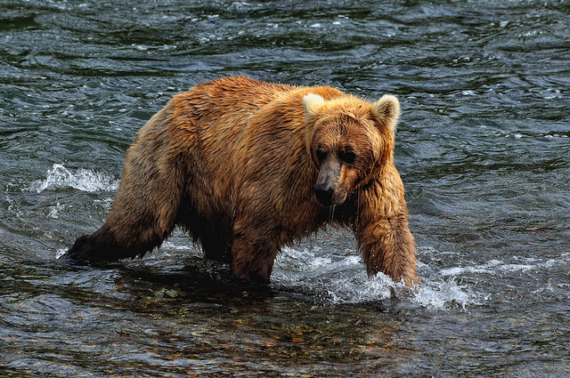

#Vision-Language Instruction Tuning: A Review and Analysis

---

##📆 Schedule


##🗒️ Existing VLIT Dataset


##📂 Multi-Modal Instruction Data Constructed in This Paper

We use GPT-3.5 to generate a batch of multi-modal instruction data based on COCO 2014 and corresponding annotation data.
The generated instruction data is multiple rounds of questions and answers for a picture, and the data format is as shown in the following example.

### Example 1

| Image | Conversation |
| :---: | :--- |
|  | User: Can you describe the scene in the image?<br>AI: Sure, the image captures a large grizzly bear wading through a moving river. The bear has a brown coat and appears to be quite large and furry. It's currently not holding anything in its mouth and it doesn't seem to have caught any fish from the river.<br>User: Are grizzly bears typically found in such environments?<br>AI: Yes, indeed. Grizzly bears are often found near rivers or streams. They are excellent swimmers and often go into the water in search of food. During salmon spawning seasons, they are known to frequent river areas to catch the fish.<br>User: Is the bear possibly looking for food?<br>AI: That's a strong possibility. While there are no fish present in the river in the image, grizzly bears are known to forage for various food sources in rivers, including fish and other aquatic organisms. However, without further context, it's hard to say definitively.<br>User: What other characteristics does a grizzly bear have?<br>AI: Grizzly bears, which are a subspecies of brown bear, are known for their size, strength, and excellent swimming ability. They have a distinct hump over their shoulders which is a muscle mass used for digging and clawing. Their fur color can vary from very light tan to dark brown, with the fur on their back often being darker than the rest of their body. Also, despite their large size, grizzlies are quite fast and can run at speeds of up to 30 miles per hour. |


Among them, there are three different types of instruction data. The data statistics and download links are as follows.


##📎 Citation
If you found this repository useful, please consider citing:

```
@article{li2023visionlanguage,
      title={Vision-Language Instruction Tuning: A Review and Analysis}, 
      author={Chen Li and Yixiao Ge and Dian Li and Ying Shan},
      year={2023},
      eprint={2311.08172},
      archivePrefix={arXiv},
      primaryClass={cs.MM}
}
```